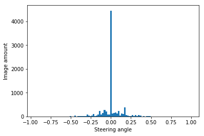
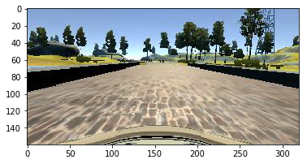
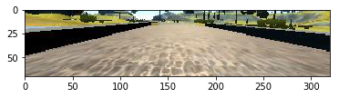
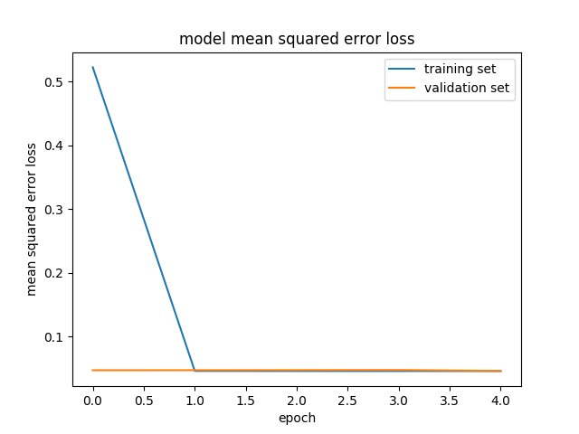
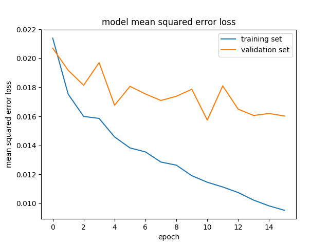

# Behavioral Cloning Project

Overview
---

**Objectives:** The Objective of this project is to use deep neural networks to clone driving behavior.  The neural networks model is trained, validated and tested in Keras with image and measurements data  from simulator where a car can be steered around a track for data collection. The trained model is used to drive the car autonomously around the track.

**Steps:**
* Use the simulator to collect data of good driving behavior
* Design, train and validate a model that predicts a steering angle from image data
* Use the model to drive the vehicle autonomously around the first track in the simulator. The vehicle should remain on the road for an entire loop around the track.

**Files:**
`data`: it is the folder where camera images and steering angle measurement are. 
`model.py`: code to collect data and set up neural network model.
`drive.py`: code to drive the car in simulator with neural network model.
`run`: it is the folder where images are when the network model drive car.
`vedio.py`: code to generate video from images in `run` folder. 

**Dependencies:**
* Library:  [CarND Term1 Starter Kit](https://github.com/udacity/CarND-Term1-Starter-Kit)
* Video simulator: [Simulator](https://github.com/udacity/self-driving-car-sim)

**Run this project:** 

Download [sample driving data](https://d17h27t6h515a5.cloudfront.net/topher/2016/December/584f6edd_data/data.zip) to the workspace. It is the data to train the neural network model. Extract the zip file to "data\".

`python model.py`: set up neural network model.
`python drive.py model.h5 run`: drive car with neural network model, store images in `run` folder. 
`python vedio.py run`: generate video with images in `run` folder.

**Submission:**

`model.py`    `drive.py`  `model.h5 `  `video.mp4`  `readme.md`


## Process

### Data collection

**code** : `line 83 - line 101`

In the simulator, the car is equipped with 3 camera at the front of car. The following table shows an example of images each camera captured. These three cameras records the behavior of a driver when driving the car. Also sensors on car records the steering angle of car. The images and steering angle are used as input for neural network model

| Left Camera                                      | Central Camera                                        | Right Camera                                       |
| ------------------------------------------------ | ----------------------------------------------------- | -------------------------------------------------- |
|  |  |  |

Image data is in the folder `data`

##### Left Camera and Right Camera steering adjustment:

**code** : `line 53 - line 59`

Left Camera and Right Camera images are also used for training the model. Two points about these images should be noted.

* These images provide more data for training. They teach the vehicle how to turn back to the center if it drift off to the side.
* To achieve this point, we need to adjust the steering measurement. For left camera, $Steering_{adjust} = Steering + 0.2$ For right camera, $Steering_{adjust} = Steering - 0.2 $

##### Get rid of some images with 0 steering angle:

**code** : `line 95 - line 99`

From the picture below, we can see that most of the images in the data set has 0 steering angle. The neural network learns very little from this images about how to steer at turns. So I get rid of 60% images with 0 steering angle.




### Data preprocessing & Argumentation

##### Normalization:

**code** : `line 116`

Value of each pixel of raw image is in the  range [0, 255]. Through normalization, pixel value is set to [-0.5, 0.5], by the formula 

​							$pixel_{normal} = \frac{pixcel}{255}-0.5​$  

##### Image Cropping:
**code** : `line 119`
The size of raw image is 160x320x3, and the upper part of image contains distractive information. For each image, the 60 pixels at top and 25 pixels at bottom are removed. This operation is carried out by `model.add(Cropping2D(cropping=((60,25),(0,0))))`

|               Before Cropping                |               After Cropping               |
| :------------------------------------------: | :----------------------------------------: |
|  |  |

##### Data Augmentation:

**code** : `line 64 - line 70`

The track is a loop, so the steering would be pushed more to the left or right depending on the vehicle is driven clockwise or counter-clockwise. We could augment data by just flipping the images and taking the opposite sign of steering measurement. This  technology is applied in this project.


### Model Architecture
**code** : `line 112 - line 145`
A model whose architecture is similar with that of the paper published by [NVDIA](<http://images.nvidia.com/content/tegra/automotive/images/2016/solutions/pdf/end-to-end-dl-using-px.pdf>) is used in this project. The following table and list shows the summary of neural network used in this project.

Model Layers:

- Image normalization

- Image Cropping

- Convolution: 5x5, filter: 24, strides: 2x2, activation: Relu

- Convolution: 5x5, filter: 36, strides: 2x2, activation: Relu

- Convolution: 5x5, filter: 48, strides: 2x2, activation: Relu

- Convolution: 3x3, filter: 64, strides: 1x1, activation: Relu

- Convolution: 3x3, filter: 64, strides: 1x1, activation: Relu

- Fully Connected: neurons: 4224

- Drop out (0.5)

- Fully connected: neurons: 100

- Fully connected: neurons: 50

- Fully connected: neurons: 10

- Fully connected: neurons: 1 (output)

  

```
_________________________________________________________________
Layer (type)                 Output Shape              Param #   
=================================================================
lambda_1 (Lambda)            (None, 160, 320, 3)       0         
_________________________________________________________________
cropping2d_1 (Cropping2D)    (None, 75, 320, 3)        0         
_________________________________________________________________
conv2d_1 (Conv2D)            (None, 36, 158, 24)       1824      
_________________________________________________________________
conv2d_2 (Conv2D)            (None, 16, 77, 36)        21636     
_________________________________________________________________
conv2d_3 (Conv2D)            (None, 6, 37, 48)         43248     
_________________________________________________________________
conv2d_4 (Conv2D)            (None, 4, 35, 64)         27712     
_________________________________________________________________
conv2d_5 (Conv2D)            (None, 2, 33, 64)         36928     
_________________________________________________________________
flatten_1 (Flatten)          (None, 4224)              0         
_________________________________________________________________
dropout_1 (Dropout)          (None, 4224)              0         
_________________________________________________________________
dense_1 (Dense)              (None, 100)               422500    
_________________________________________________________________
dense_2 (Dense)              (None, 50)                5050      
_________________________________________________________________
dense_3 (Dense)              (None, 10)                510       
_________________________________________________________________
dense_4 (Dense)              (None, 1)                 11        
=================================================================
Total params: 559,419
Trainable params: 559,419
Non-trainable params: 0
_________________________________________________________________
```

##### Avoid Over-fitting 
**code** : `line 130`
To avoid over fitting, **drop out layer** is used in this model and the drop out possibility is set to 0.5. As we see in the loss visualization section, the loss for training set and validation set is small and decrease with epochs. Also, in the video,  vehicle behaves well on road under the control this this model. So over-fitting is not a issue for this model.

##### Parameter Tuning
* Learning Rate: I tied to increase the learning rate to 0.01, however, this result in that loss converge is big initially, and then converge very fast. When learning rate is 0.001, the loss is always at low level and it keeps decreasing with epoch, which is more preferable. So I set learning rate to 0.001 for this model.

|      Learning rate 0.01      |      Learning rate 0.001       |
| :--------------------------: | :----------------------------: |
|  |  |

* Epoch: For the case learning rate = 0.001, the epoch number is increased to 16, and the loss is like the plot blow. Since the validation set loss does not decrease obviously after 5th epoch. I set epoch to 5 in this model.

  

##### Data generator

**code** : `line 36 - line 75`

Data generator is used in the the code for training rather than storing the training data in memory. 


### Output Video:

|                         Camera View                          |                         General View                         |
| :----------------------------------------------------------: | :----------------------------------------------------------: |
| [](http://www.youtube.com/watch?v=hvtmx4p3BFg "Video Title") | [](http://www.youtube.com/watch?v=DfJ8Ur-AfEk "Video Title") |
|  [Video Link](https://www.youtube.com/watch?v=hvtmx4p3BFg)   |          [Video Link](https://youtu.be/DfJ8Ur-AfEk)          |

